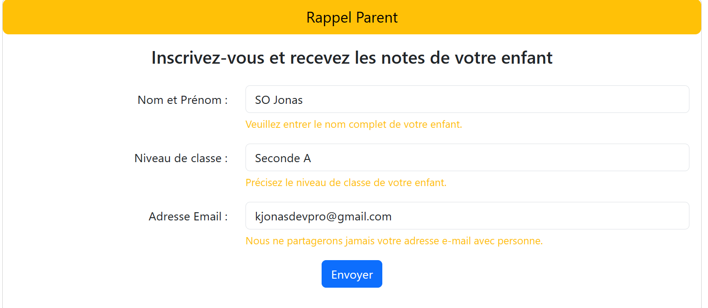
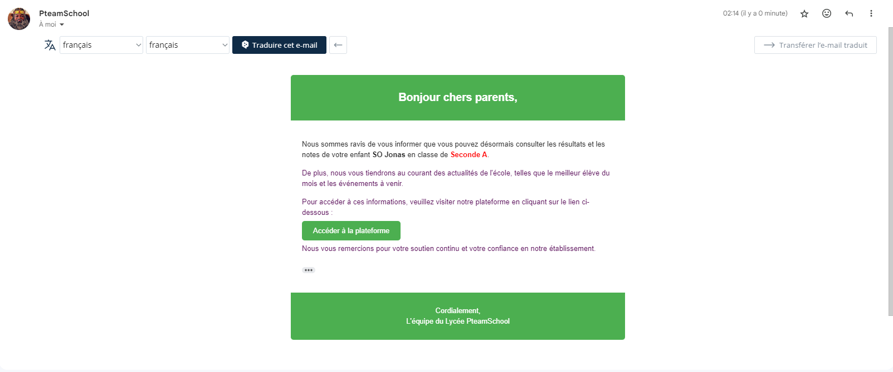

# NOTIFICATION DE NOTE AUX PARENTS D'ELEVE

Bienvenue sur notre plateforme de notification de notes aux parents d'élève. Cette application facilite la réception des résultats académiques de votre enfant directement dans votre boîte e-mail. Pour commencer, suivez les étapes ci-dessous

    Notez que ce projet a été développé avec Laravel 10.

## Comment Utiliser la Plateforme
1. Inscription 
    - Accédez à la page d'inscription.
    - Remplissez le formulaire en indiquant le nom, le prénom, la classe de votre enfant et votre adresse e-mail.

    

    - Cliquez sur le bouton [Envoyer].

2. Confirmation par E-mail :
    - Vous recevrez un e-mail de confirmation indiquant que votre adresse e-mail a été enregistrée avec succès.

    
    
3. Réception des Notes :
    - Dès que les notes de votre enfant sont disponibles, vous recevrez automatiquement un e-mail avec les détails.

## Installation (pour les développeurs)
Si vous souhaitez contribuer au développement de cette plateforme, suivez ces étapes pour l'installer localement :

`Cloner le repository`

    git clone https://github.com/jonasdevpro/EnvoiTestMail.git

` Accéder au répertoire du projet`

    cd EnvoiTestMail

`Installer les dépendances`

    composer install

`Copier le fichier .env`

    cp .env.example .env

`Générer la clé d'application`

    php artisan key:generate

### Configurer votre SMTP dans le fichier .env 

`Effectuer les migrations`

    php artisan migrate

`Lancer le serveur`

    php artisan serve

Explorez la plateforme et restez informé(e) des performances académiques de votre enfant en temps réel !

## Auteur

[Jonasdev](https://www.linkedin.com/in/jonas-so-784515274) - Développeur Full Stack 

Pour toute question ou assistance, veuillez:
[Contactez-moi sur WhatsApp](https://wa.me/+22652645634)

##